# Store POS အသုံးပြုသူလမ်းညွှန်

ဤလမ်းညွှန်သည် Store POS စနစ်ကို မြန်မာဘာသာဖြင့် အသုံးပြုရန်အတွက် ဖြစ်ပါသည်။ ညာဘက်အပေါ်ရှိ ဘာသာစကားရွေးချယ်မှုမှ `မြန်မာ` သို့မဟုတ် `English` ကို ရွေးနိုင်ပါသည်။

## ၁။ ဝင်ရောက်ခြင်း

1. Email ထည့်ပါ။
2. Password ထည့်ပါ။
3. `မှတ်ထားမည်` ကို လိုအပ်ပါက ရွေးပါ။
4. `ဝင်ရောက်မည်` ကို နှိပ်ပါ။
5. Password မေ့ပါက `စကားဝှက်မေ့နေပါသလား။` ကို နှိပ်ပြီး Email ဖြင့် ပြန်လည်သတ်မှတ်ပါ။

## ၂။ Dashboard

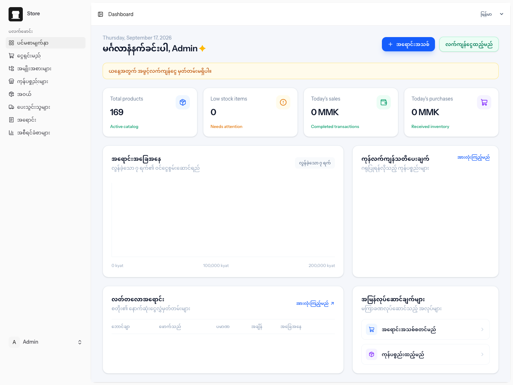

Dashboard တွင် အောက်ပါအချက်များကို ကြည့်နိုင်ပါသည်။

- အသုံးပြုနေသော ကုန်ပစ္စည်းအရေအတွက်
- လက်ကျန်နည်းသော ကုန်ပစ္စည်းများ
- ယနေ့အရောင်းနှင့် အဝယ်
- အဖွင့်လက်ကျန်ငွေ၊ ပြန်အမ်းငွေနှင့် မျှော်မှန်းပိတ်လက်ကျန်
- လွန်ခဲ့သော ၇ ရက်အရောင်းအခြေအနေ
- လတ်တလောအရောင်းများ

`အဖွင့်လက်ကျန်ငွေထည့်မည်` ကို နှိပ်၍ ယနေ့အတွက် စတင်ငွေကို မှတ်တမ်းတင်နိုင်ပါသည်။ `အရောင်းအသစ်` နှင့် `ကုန်ပစ္စည်းထည့်မည်` မှလည်း သက်ဆိုင်ရာစာမျက်နှာသို့ တိုက်ရိုက်သွားနိုင်ပါသည်။

## ၃။ ငွေရှင်းကောင်တာ

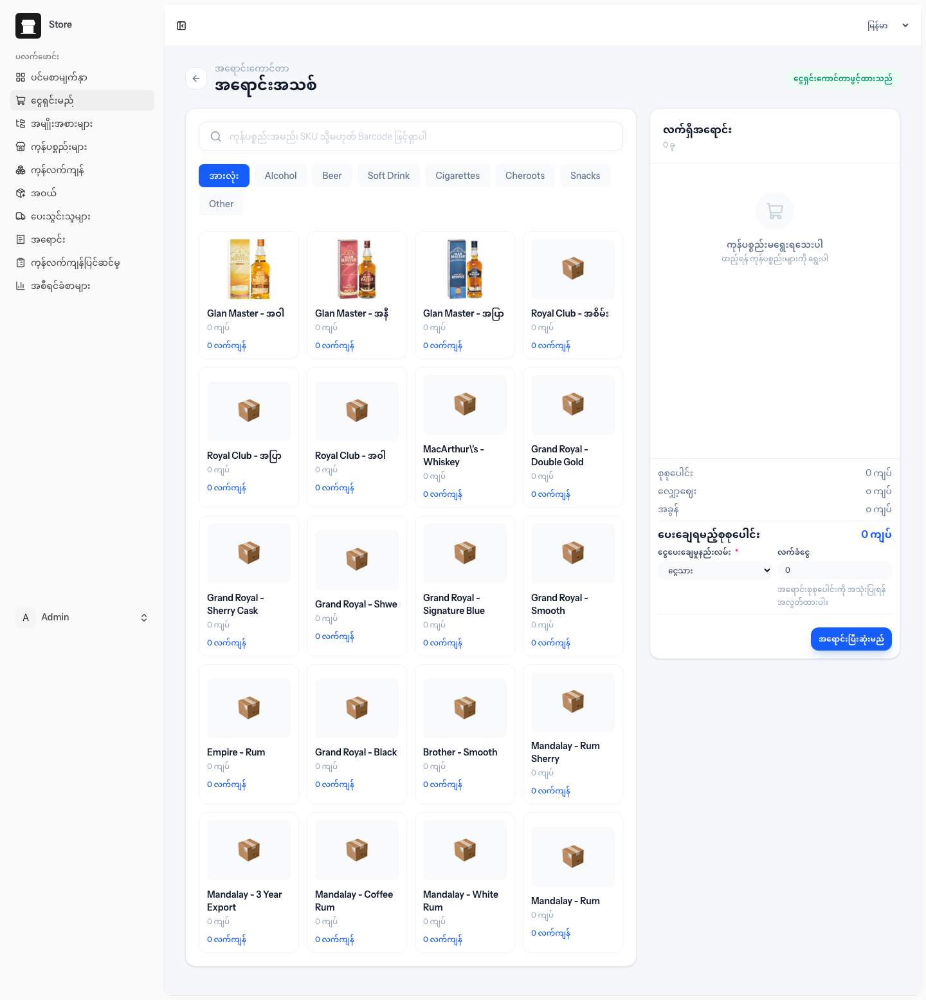

1. Search box တွင် ကုန်ပစ္စည်းအမည်၊ SKU သို့မဟုတ် Barcode ဖြင့် ရှာပါ။
2. ကုန်ပစ္စည်းကို နှိပ်၍ အရောင်းစာရင်းထဲ ထည့်ပါ။
3. Category ခလုတ်ဖြင့် အမျိုးအစားအလိုက် စစ်ထုတ်ပါ။
4. အရောင်းစာရင်းထဲတွင် ရောင်းချမည့်ယူနစ်ကို ရွေးပါ။
5. `+` နှင့် `−` ဖြင့် အရေအတွက်ပြင်ပါ။
6. Payment method ရွေးပြီး လက်ခံငွေထည့်ပါ။
7. `အရောင်းပြီးဆုံးမည်` ကို နှိပ်ပါ။

Barcode သို့မဟုတ် SKU ကို ရိုက်ပြီး Enter နှိပ်လျှင်လည်း ကုန်ပစ္စည်းထည့်နိုင်ပါသည်။ `F2` သည် Search box ကို focus လုပ်ပေးပြီး `F8` သည် အရောင်းပြီးဆုံးစေပါသည်။

## ၄။ ကုန်ပစ္စည်းများ

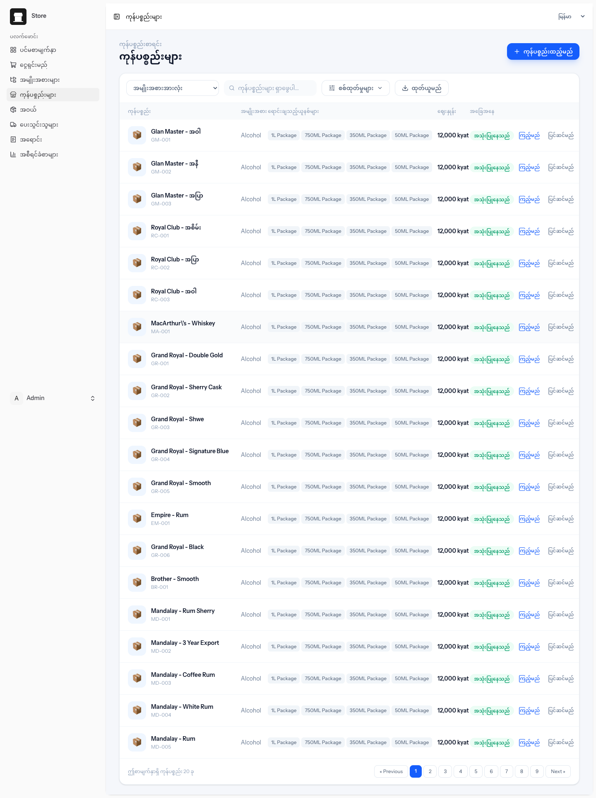

ကုန်ပစ္စည်းစာရင်းတွင် အမည်/SKU ရှာခြင်း၊ Category စစ်ထုတ်ခြင်း၊ လက်ကျန်နည်းသောပစ္စည်းများသာကြည့်ခြင်း၊ CSV ထုတ်ယူခြင်းနှင့် စာမျက်နှာခွဲကြည့်ခြင်းတို့ ပြုလုပ်နိုင်ပါသည်။

### ကုန်ပစ္စည်းအသစ်ထည့်ခြင်း

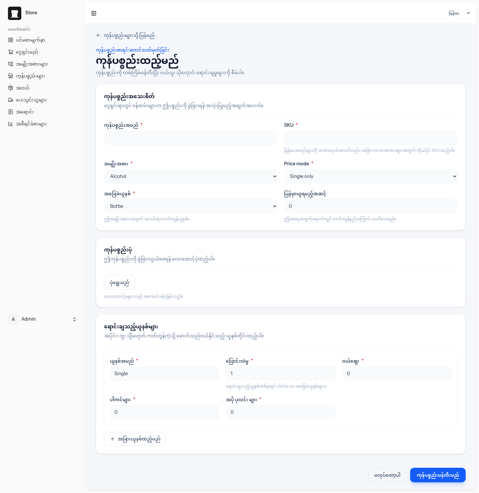

1. `ကုန်ပစ္စည်းထည့်မည်` ကို နှိပ်ပါ။
2. အမည်၊ SKU၊ Category၊ အခြေခံယူနစ်၊ ဝယ်ဈေးနှင့် ပြန်မှာယူရမည့်အဆင့် ဖြည့်ပါ။
3. လိုအပ်ပါက ပုံထည့်ပြီး crop ပြုလုပ်ပါ။
4. ရောင်းချမည့်ယူနစ်၊ Conversion နှင့် ရောင်းဈေးများ ထည့်ပါ။
5. `ကုန်ပစ္စည်းဖန်တီးမည်` ကို နှိပ်ပါ။

### အသေးစိတ်နှင့် အမြန်ပြင်ဆင်ခြင်း

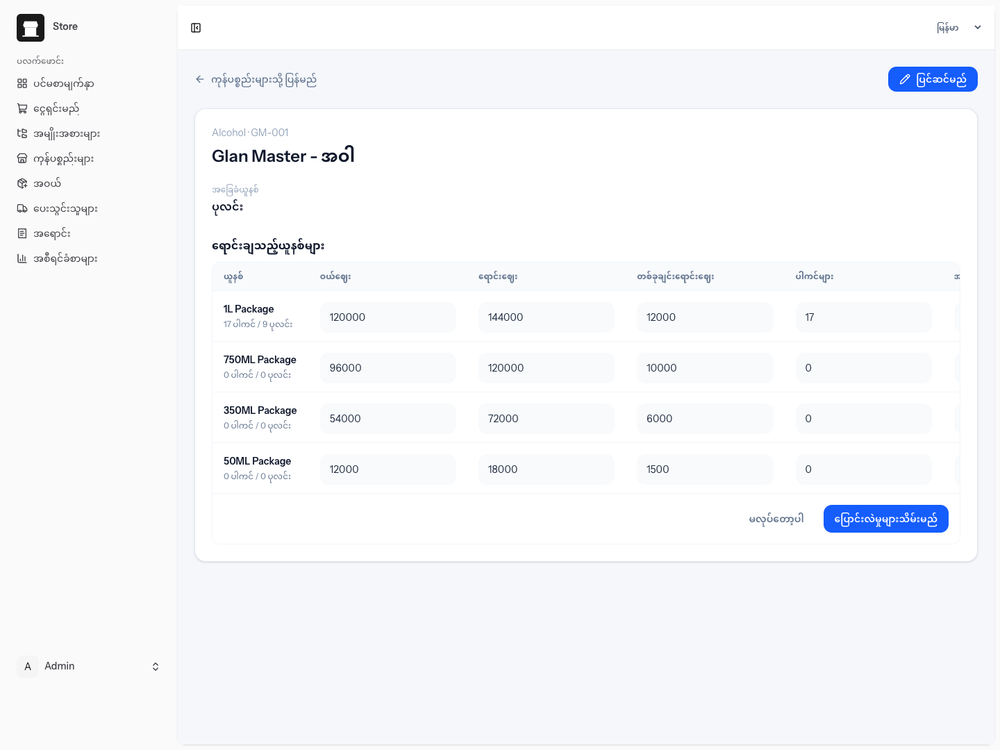

ကုန်ပစ္စည်းအသေးစိတ်စာမျက်နှာတွင် လက်ကျန်၊ ယူနစ်နှင့် ဈေးနှုန်းများကို ကြည့်နိုင်ပါသည်။ `Quick update` ဖြင့် အထုပ်/အပိုယူနစ်လက်ကျန်နှင့် ယူနစ်ဈေးများကို အမြန်ပြင်နိုင်ပါသည်။ `Edit` ဖြင့် ကုန်ပစ္စည်းအချက်အလက်အားလုံး ပြင်နိုင်ပါသည်။

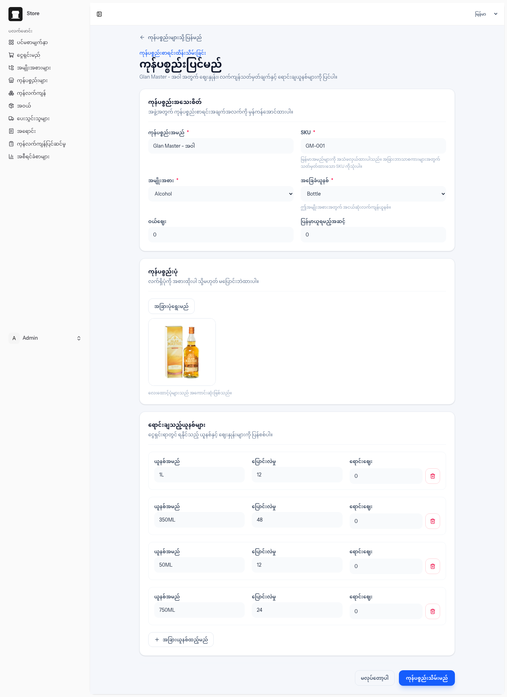

## ၅။ Category များ

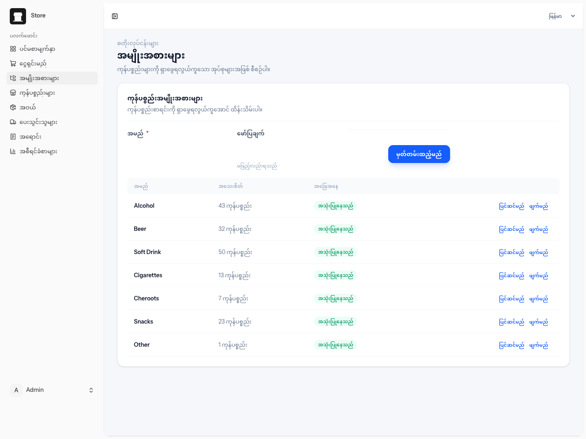

1. Category အမည်နှင့် ဖော်ပြချက်ထည့်ပါ။
2. `ထည့်မည်` ကို နှိပ်ပါ။
3. ရှိပြီးသား Category ကို `ပြင်ဆင်မည်` ဖြင့် ပြင်ပါ။
4. မလိုအပ်တော့ပါက ဖျက်နိုင်ပါသည်။

ထို Category တွင် ကုန်ပစ္စည်းများရှိနေပါက ဖျက်၍မရနိုင်ပါ။

## ၆။ ပေးသွင်းသူများ

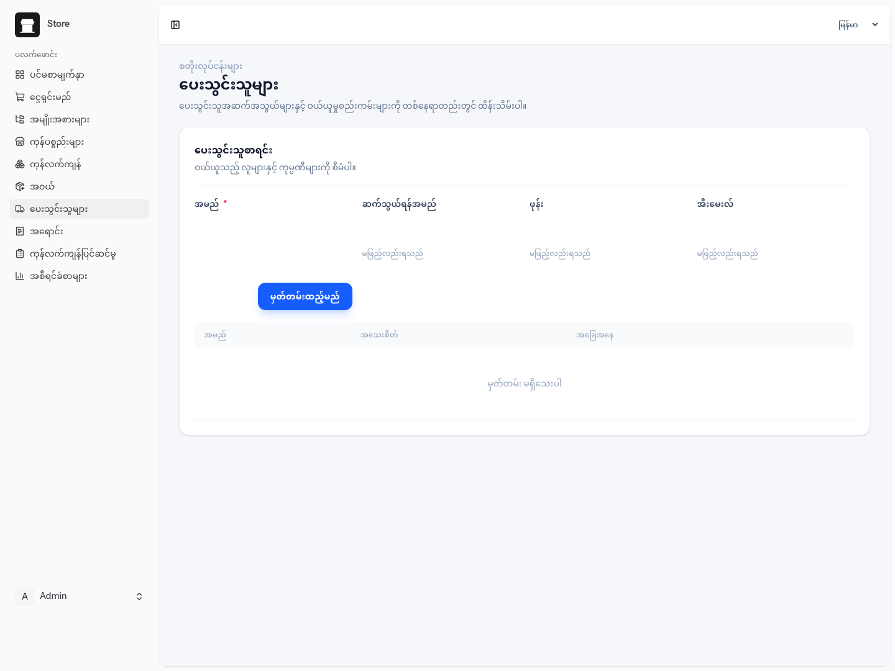

ပေးသွင်းသူအမည်၊ ဆက်သွယ်ရန်အမည်၊ ဖုန်း၊ Email နှင့် လိပ်စာကို ထည့်သွင်း/ပြင်ဆင်နိုင်ပါသည်။ မသုံးတော့သော ပေးသွင်းသူကို Archive ပြုလုပ်နိုင်ပါသည်။

## ၇။ အဝယ်

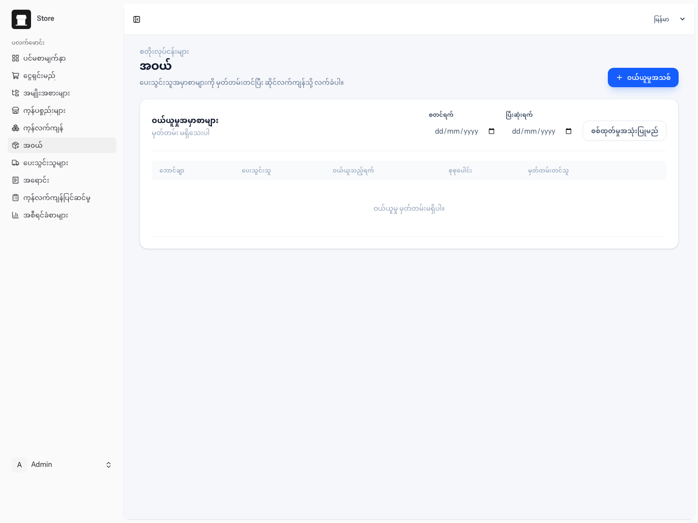

အဝယ်စာရင်းတွင် စတင်ရက်နှင့် ပြီးဆုံးရက်ရွေးပြီး အချိန်အပိုင်းအခြားအလိုက် စစ်ထုတ်နိုင်ပါသည်။ Invoice ကို နှိပ်၍ အဝယ်အသေးစိတ်ကြည့်နိုင်ပါသည်။

### အဝယ်အသစ်

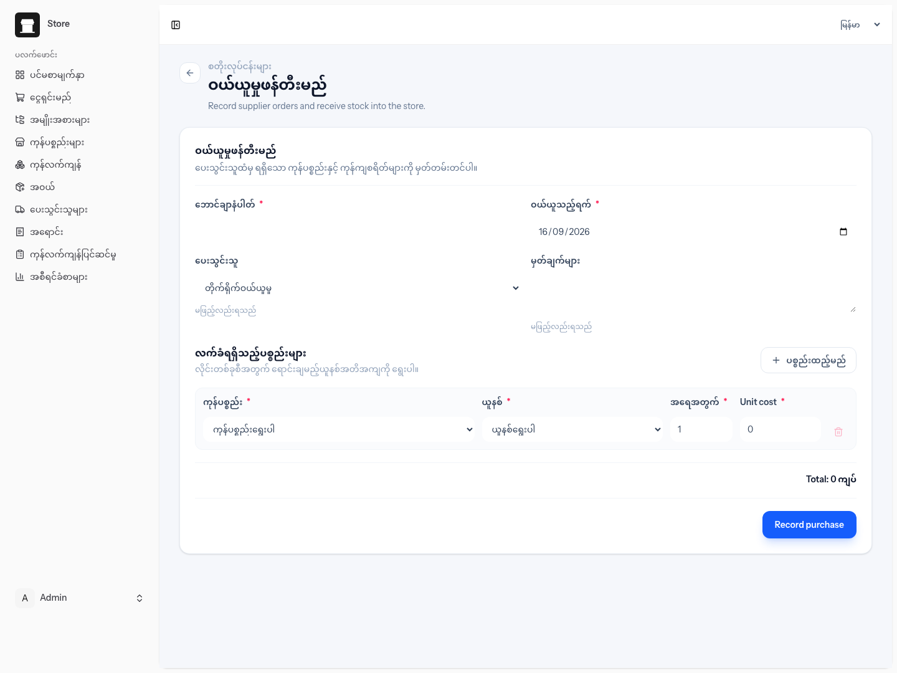

1. Supplier ရွေးပါ သို့မဟုတ် Direct purchase ထားပါ။
2. Invoice နံပါတ်နှင့် ဝယ်ယူသည့်ရက် ဖြည့်ပါ။
3. Product နှင့် ရောင်းချယူနစ်ရွေးပါ။
4. Quantity နှင့် Unit cost ထည့်ပါ။
5. လိုအပ်ပါက အဝယ်လိုင်းများ ထပ်ထည့်ပါ။
6. သိမ်းပါ။

အဝယ်သိမ်းပြီးလျှင် Stock သည် အလိုအလျောက် တိုးလာပါမည်။

## ၈။ Inventory

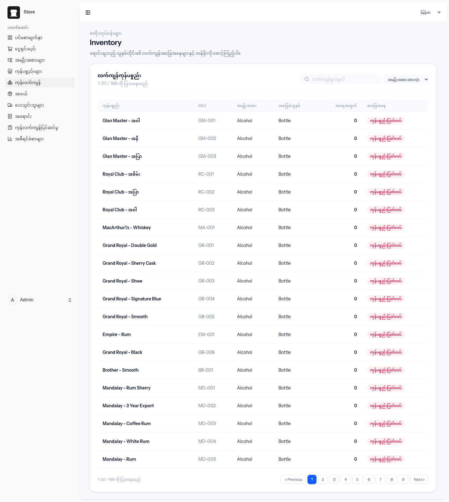

Inventory စာမျက်နှာတွင် Product အမည်/SKU ဖြင့်ရှာခြင်း၊ Category ဖြင့်စစ်ထုတ်ခြင်း၊ Stock အခြေအနေကြည့်ခြင်းနှင့် စာမျက်နှာခွဲကြည့်ခြင်းတို့ ပြုလုပ်နိုင်ပါသည်။

- `Out of stock` — လက်ကျန်မရှိပါ။
- `Low stock` — ပြန်မှာယူရမည့်အဆင့်အောက် ရောက်နေပါသည်။
- `Healthy` — လက်ကျန်အခြေအနေ ကောင်းမွန်ပါသည်။

## ၉။ Stock Adjustment

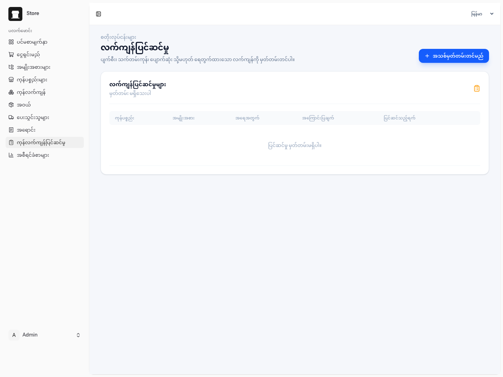

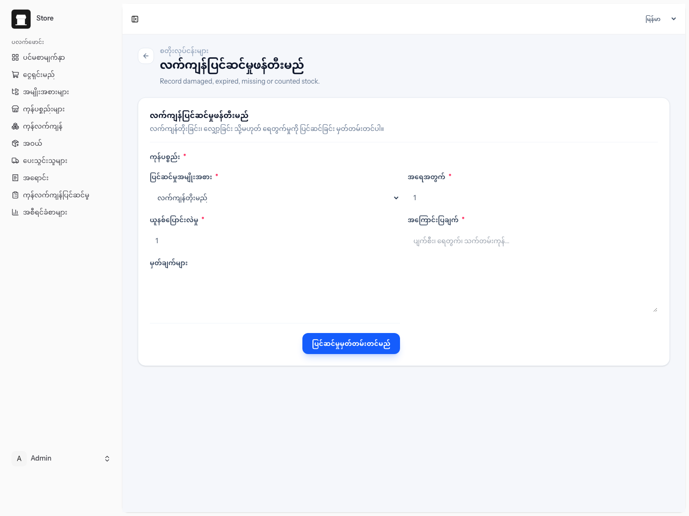

1. Product ရွေးပါ။
2. `Increase` ဖြင့် လက်ကျန်တိုးပါ။
3. `Decrease` ဖြင့် လက်ကျန်လျှော့ပါ။
4. `Count` ဖြင့် ရေတွက်ပြီး လက်ကျန်အသစ်သတ်မှတ်ပါ။
5. Quantity၊ Unit conversion နှင့် အကြောင်းပြချက် ဖြည့်ပါ။
6. `မှတ်တမ်းတင်မည်` ကို နှိပ်ပါ။

Adjustment ပြုလုပ်ပြီးလျှင် Stock နှင့် Stock transaction မှတ်တမ်းများကို အလိုအလျောက် မွမ်းမံပါမည်။

## ၁၀။ အရောင်းမှတ်တမ်း

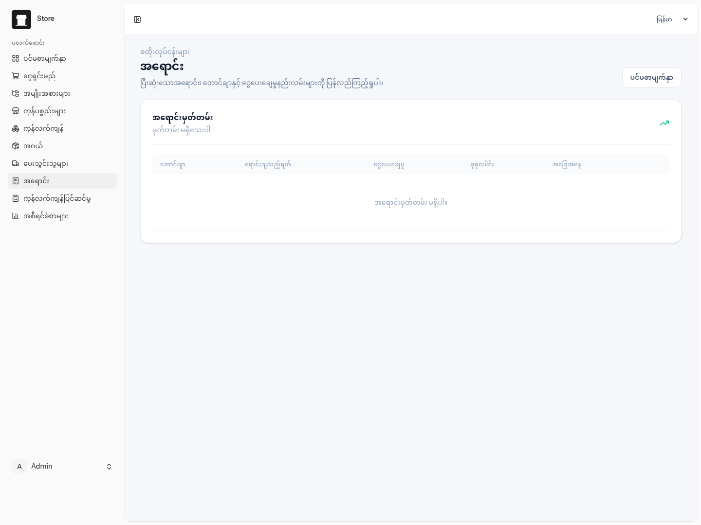

အရောင်း Invoice၊ ရောင်းချသည့်ရက်၊ Payment method၊ စုစုပေါင်းနှင့် အခြေအနေကို ကြည့်နိုင်ပါသည်။ Invoice ကို နှိပ်၍ အသေးစိတ်ကြည့်ပြီး Receipt ကို ပုံနှိပ်နိုင်ပါသည်။ Completed အရောင်းကို အကြောင်းပြချက်ထည့်၍ Cancel ပြုလုပ်နိုင်ပါသည်။ Cancel ပြုလုပ်လျှင် သက်ဆိုင်ရာ Stock ပြန်တိုးပေးပါမည်။

## ၁၁။ အစီရင်ခံစာများ

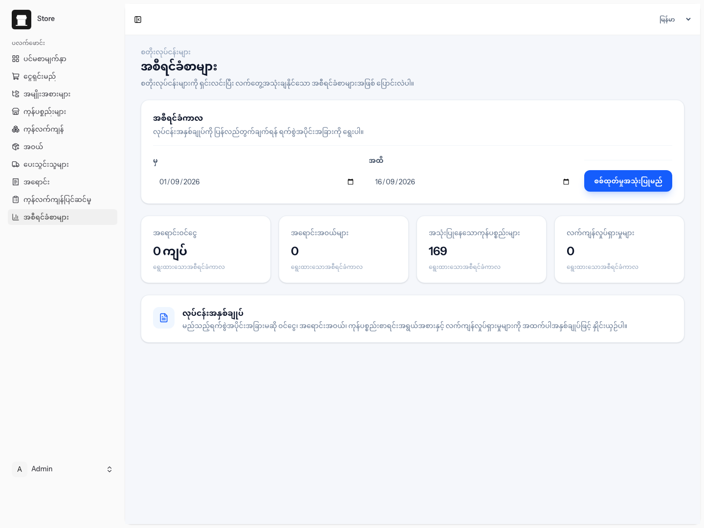

From နှင့် To ရက်စွဲရွေးပြီး `စစ်ထုတ်မည်` ကို နှိပ်ပါ။ ထိုအချိန်အပိုင်းအခြားအတွက် အောက်ပါအချက်များကို ပြသပါမည်။

- အရောင်းဝင်ငွေ
- အရောင်းအဝယ်အရေအတွက်
- Active Product အရေအတွက်
- Stock movement အရေအတွက်

## ၁၂။ Settings

### Profile

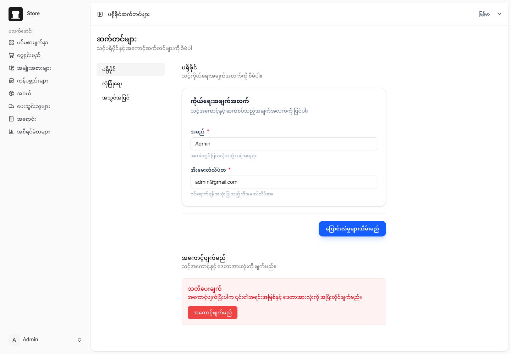

အမည်နှင့် Email ကို ပြင်ပြီး သိမ်းနိုင်ပါသည်။

### Security

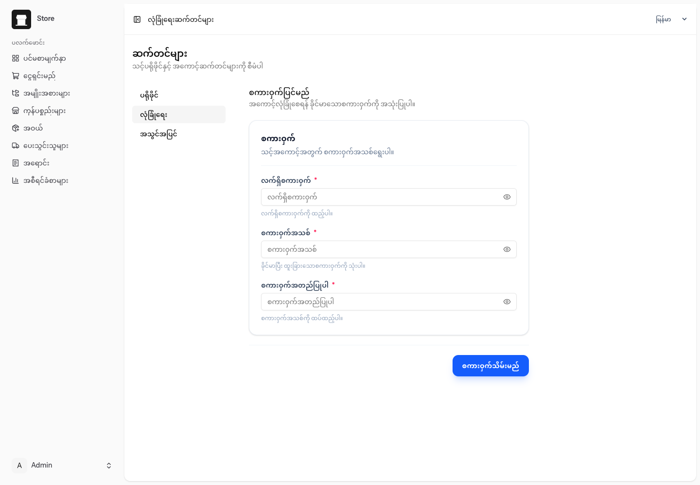

လက်ရှိ Password အတည်ပြုပြီး Password အသစ်ပြောင်းနိုင်ပါသည်။

### Appearance

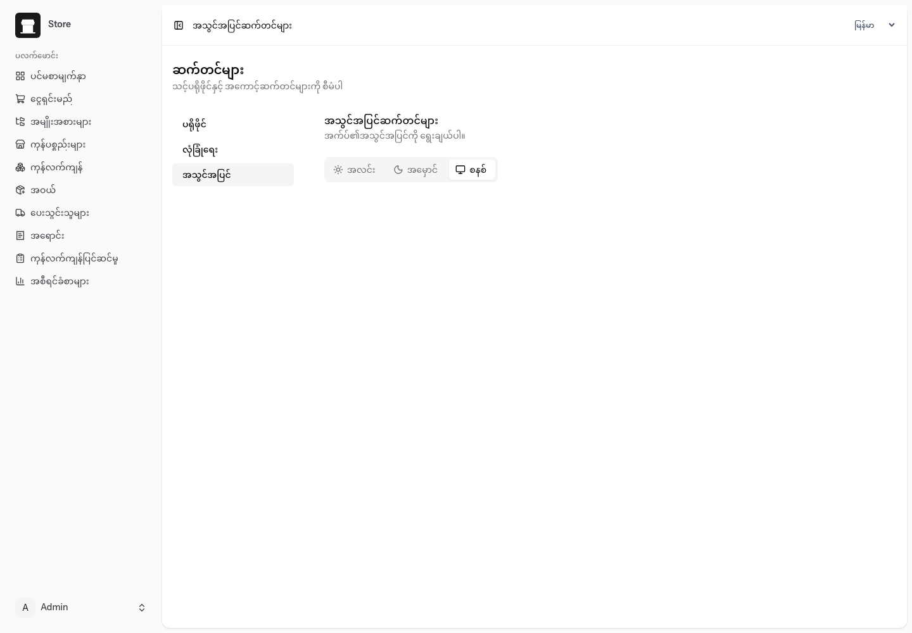

Light၊ Dark သို့မဟုတ် System theme ကို ရွေးနိုင်ပါသည်။

## ၁၃။ အသုံးပြုသူအခွင့်အရေး

| လုပ်ဆောင်ချက် | Admin | Manager | Cashier |
|---|---:|---:|---:|
| Dashboard၊ Checkout၊ Sales ကြည့်ခြင်း | ရ | ရ | ရ |
| Product ထည့်/ပြင်/Archive | ရ | ရ | မရ |
| Category နှင့် Supplier စီမံခြင်း | ရ | ရ | မရ |
| Purchase နှင့် Inventory စီမံခြင်း | ရ | ရ | မရ |
| Stock Adjustment နှင့် Reports | ရ | ရ | မရ |
| Sale Cancel | ရ | ရ | မရ |

Cashier အတွက် Dashboard၊ Checkout၊ Products နှင့် Sales များကိုသာ အသုံးပြုနိုင်အောင် ကန့်သတ်ထားပါသည်။

## ၁၄။ Demo အကောင့်

| အမျိုးအစား | Email | Password |
|---|---|---|
| Admin | `admin@gmail.com` | `password` |
| Cashier | `cashier@gmail.com` | `password` |

Demo အကောင့်များကို ထုတ်လုပ်မှုစနစ်တွင် မသုံးပါနှင့်။
